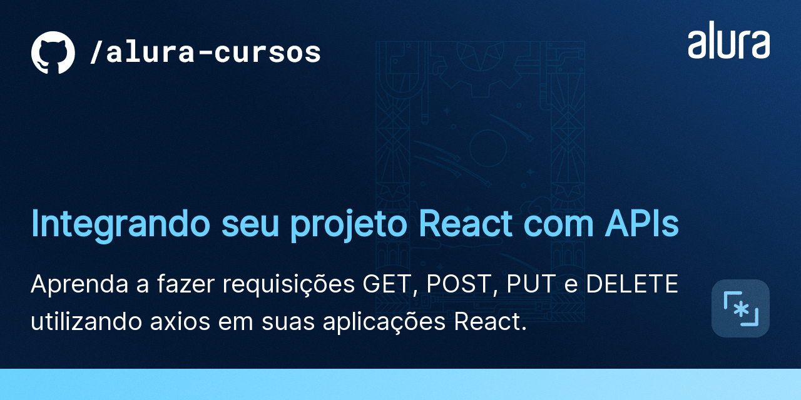

# Curso React: integrando seu projeto React com APIs (Programa Desenvolve da Boticário e Alura)

> Status do projeto: em desenvolvimento

Conteúdo do curso:

* Baixamos e configuramos as dependências do Alfood;
* Utilizamos o swagger para entender como a nova API funciona;
* Instalamos e preparamos o axios;
* Fizemos requisições GET, para listar pratos e restaurantes;
* Instalamos e utilizamos a biblioteca MUI;
* Implementamos a listagem de restaurantes realizando uma requisição GET;
* Criamos a rotina de cadastro de restaurantes com o verbo HTTP POST;
* Realizamos requisições utilizando os verbos PUT e DELETE;
* Enviamos parâmetros em requisições GET;
* Montamos um formulário de busca de restaurantes;
* Organizamos o layout com elementos do MUI;
* Organizamos o nosso código, centralizando a criação de um cliente do axios;
* Utilizamos a ordenação de restaurantes da API.

-----

# Alfood

O Alfood é um site que lista restaurantes e pratos do menu. 
É um MVP que tá só começando e ainda tem muitas funcionalidades novas para serem desenvolvidas.

## 🔨 Funcionalidades do projeto

O Alfood começa com uma listagem estática de seu conteúdo e é esse o problema que queremos resolver.
No decorrer do curso, vamos implementar toda a camada de comunicação com a API.

## ✔️ Técnicas e tecnologias utilizadas

Se liga nessa lista de tudo que usaremos nesse treinamento:

- `React`
- `React Hooks`
- `TypeScript`
- `axios`

## 🛠️ Abrir e rodar o projeto

Para abrir e rodar o projeto, execute npm i para instalar as dependências e npm start para inicar o projeto.

Depois, acesse <a href="http://localhost:3000/">http://localhost:3000/</a> no seu navegador.

## 📚 Mais informações do curso

Busque na plataforma da Alura o curso **Integrando seu projeto React com APIs** publicado na Escola Frontend.